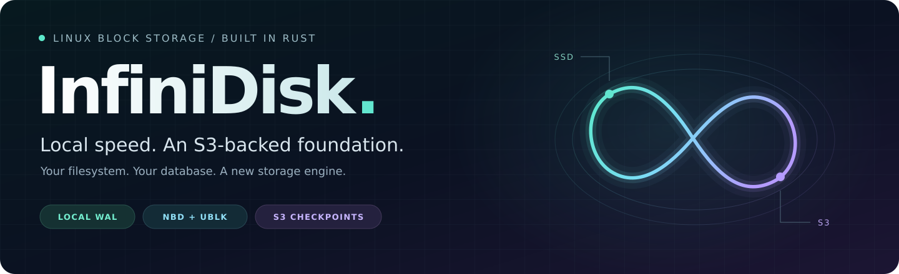
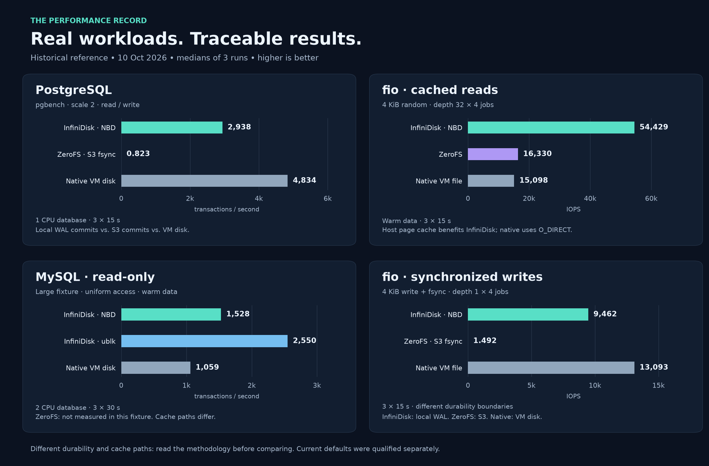
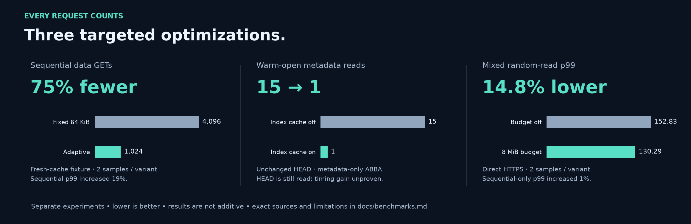
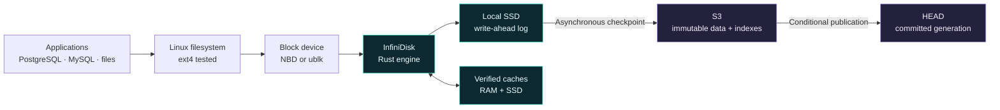

<p align="center">
  
</p>

<p align="center">
  <strong>Linux block storage · Rust · Local durable WAL · Asynchronous S3 checkpoints</strong><br>
  NBD included. Experimental ublk / io_uring available.
</p>

<p align="center">
  <a href="#performance">Performance</a> ·
  <a href="#how-it-works">Architecture</a> ·
  <a href="#quick-start">Quick start</a> ·
  <a href="#durability">Durability</a> ·
  <a href="#the-default-profile">Defaults</a> ·
  <a href="docs/operations.md">Operations</a>
</p>

**InfiniDisk turns a dedicated S3 prefix into a Linux block device.** Put ext4 on it, mount it, and use ordinary files, PostgreSQL or MySQL. A local SSD write-ahead log handles the commit path; verified caches serve the working set; immutable checkpoints carry the volume to object storage.

This is the second-generation, standalone Rust engine. Its executable is **`infinidisk`**. The data path includes its own Linux NBD client and requires no ZeroFS process.

> **Status: experimental · v0.1.0.** Database workloads and recovery scenarios have been exercised, but production safety across all hardware, filesystems and S3 providers has not been established. The default acknowledges durability on the **local disk**; S3 persistence follows asynchronously.

## Performance

### PostgreSQL. MySQL. fio. The measurements are included.



**Reference campaign: 10 October 2026, historical `b39b705f43b6` build.** Bars show medians of three runs on one shared VM. These are reference measurements, not a rerun of today's default profile. MySQL's large-fixture chart includes NBD and ublk; ZeroFS was not measured in that fixture.

The comparisons need three pieces of context:

- **Commit contracts differ.** InfiniDisk confirms local WAL durability; the ZeroFS series waits for S3 on `fsync`; native storage relies on the VM disk. The write charts do not measure equal remote durability.
- **Caches matter.** InfiniDisk's warm reads can use Linux's page cache, while native fio uses `O_DIRECT` on a regular file. The read charts do not establish superiority over a physical SSD. ZeroFS also retained its compression and encryption settings.
- **Scope is explicit.** PostgreSQL and fio use 3 × 15-second runs; MySQL uses 3 × 30 seconds. Database CPU quotas exclude the separate storage process. These short tests on a shared VM are observations, not capacity guarantees.

Read the [English benchmark guide](docs/benchmarks.md) for exact values, profiles, samples and source files. It also identifies excluded SQL-error runs. The [complete comparison report](validation/astra/rapport.html) retains the wider matrix and recovery evidence; download and open the HTML locally to view it.

### Less unnecessary S3 work



These are **three separate, controlled experiments**, not additive savings or a forecast of a cloud bill:

| Improvement now enabled in new configurations | Observed result | Trade-off / scope |
| :--- | :--- | :--- |
| Adaptive 16 / 256 KiB reads | **75% fewer data GETs** in the sequential fixture; 80.2 → 105.8 MiB/s | Sequential p99 increased 19.0%; sparse random reads transferred fewer bytes but made 12.2% more GETs. |
| Verified SSD cache for remote indexes | **15 → 1 metadata reads** on an unchanged warm volume | HEAD is still fetched; no startup-time improvement was demonstrated in this metadata-only test. |
| Shared 8 MiB download admission budget | **14.8% lower random-read p99** under mixed load | Two samples per variant. Sequential-only p99 increased 1.0%; the original 5% improvement target was not met. |

The budget was selected for bounded transfers and the mixed-workload compromise. [Evidence and methodology →](docs/benchmarks.md#current-profile-improvements)

## How it works



**Writes stay close.** The engine appends writes to the local WAL. `FLUSH` and `FUA` persist the required records and a durability marker. Prepared segments, vectored writes and selective synchronization reduce work around that barrier.

**Reads follow the working set.** Recent WAL data and verified local caches satisfy hot reads. Misses fetch checked S3 ranges. Adaptive grouping uses small ranges for sparse access and larger ranges for dense access; a shared byte budget and a small-read reserve keep concurrent misses bounded.

**Checkpoints publish a complete generation.** The engine uploads immutable data, writes verified indexes, then conditionally updates HEAD. Recovery follows the published generation. CRCs detect data-record corruption; SHA-256 verifies index objects. These checks detect accidental damage, not a malicious storage provider.

S3 contains InfiniDisk's **private block-volume format**. Existing objects in a bucket do not appear as files. Use a dedicated prefix for each volume and a single active writer.

## Quick start

### 1. Build the engine

Requirements: Linux, a Rust toolchain supporting edition 2024, a C toolchain, local SSD space and access to an S3-compatible endpoint with atomic object writes and conditional updates. The validation environment used Linux x86_64 and Rust 1.99.0. NBD requires the Linux `nbd` module.

From a checkout containing this Rust engine's `Cargo.toml`:

```sh
cargo build --release --locked
sudo install -m 0755 target/release/infinidisk /usr/local/bin/infinidisk
```

The commands below run in **root shells**. Supply `AWS_ACCESS_KEY_ID`, `AWS_SECRET_ACCESS_KEY` and, when needed, `AWS_SESSION_TOKEN` to the storage process through its environment. Keep credentials out of the configuration and repository. For a local protocol sandbox, the engine also supports `file://` storage.

### 2. Configure a new volume

```sh
install -d -m 0700 /etc/infinidisk
infinidisk -c /etc/infinidisk/volume.toml config
```

Edit the connection fields in the generated file; retain its other settings:

```toml
local_dir = "/var/lib/infinidisk/volume-01"
store = "s3://YOUR-BUCKET/volumes/volume-01"
endpoint = "https://YOUR-S3-ENDPOINT"
region = "us-east-1" # Use the region required by your provider.
listen = "127.0.0.1:11900"
```

`config` writes the [recommended profile](configs/recommended.toml) and refuses to overwrite an existing file. Reserve a fresh remote prefix and an unused local directory. Each additional volume needs its own directory, prefix and listening port.

### 3. Create, attach and mount

**Terminal 1 — create the unformatted volume, then keep the server running:**

```sh
infinidisk -c /etc/infinidisk/volume.toml init --size 10GiB
infinidisk -c /etc/infinidisk/volume.toml serve
```

**Terminal 2 — select a free NBD device, then keep the attachment running:**

```sh
modprobe nbd nbds_max=32 max_part=8
infinidisk -c /etc/infinidisk/volume.toml attach --device /dev/nbd31 --connections 8
```

**Terminal 3 — format only the brand-new volume created above:**

```sh
mkfs.ext4 /dev/nbd31
mkdir -p /mnt/infinidisk
mount -o noatime /dev/nbd31 /mnt/infinidisk
df -h /mnt/infinidisk
```

`/dev/nbd31` is an example: confirm it is free before attachment. `init` refuses an existing remote volume; attachment and adoption never format it. For an existing volume, mount its existing filesystem and skip `mkfs`.

Files under `/mnt/infinidisk` now use the volume. For a database, keep its normal durability settings enabled and size the SSD cache for its active working set. An S3 cache miss still has network latency.

[Shutdown, recovery, systemd and maintenance →](docs/operations.md)

<details>
<summary><strong>Optional: use ublk / io_uring</strong></summary>

Build with the optional feature; the kernel must support `ublk_drv` and io_uring. Building the pinned libublk dependency also requires C/Clang tooling.

```sh
cargo build --release --locked --features ublk
sudo install -m 0755 target/release/infinidisk /usr/local/bin/infinidisk
sudo modprobe ublk_drv
sudo infinidisk -c /etc/infinidisk/volume.toml ublk --id 31 --queues 4
```

Use this foreground command **instead of** `serve` + `attach`, with the S3 credentials available in its environment. Choose a free ID; it exposes `/dev/ublkb31`. Apply the same new-volume formatting rules. After stopping the application and unmounting, `ublk-delete --id 31` removes the device; it refuses an unrelated or busy device.

</details>

## Durability

**Fast local commits and remote recovery have separate boundaries.** The default profile keeps local durable mode enabled; it does not turn `fsync` into a no-op.

| Event | Default behavior |
| :--- | :--- |
| Ordinary `WRITE` completes | Data has been appended locally. Unsynchronized writes may be lost in a crash. |
| `FLUSH` / `FUA` completes | The local WAL and durability marker have been synchronized. Recovery depends on the local disk honoring these barriers. |
| S3 checkpoint completes | Immutable data and checked indexes are published through a conditional HEAD update. |
| Engine process crashes | Retain the local directory, replay the WAL and perform normal filesystem / database recovery. |
| The entire local disk is lost | Restore the last complete S3 generation. Even locally synchronized commits after that generation can be lost. |
| S3 is unavailable | Retain pending WAL data. At the backlog limit, writes wait for space and eventually return an I/O error instead of growing without bound. |
| Integrity verification fails | Rebuild a damaged cache copy from a verified source when possible. Authoritative data that fails verification returns an error, never fabricated zero-filled success. |

The **5-second checkpoint interval is a scheduling target, not a guaranteed recovery-point bound**. Upload time, backlog and outages can extend the gap. The implementation assumes correct disk barriers, S3 conditional-write semantics and normal database/filesystem recovery.

One writer owns a volume. Moving it to another host requires **external fencing of the previous writer** before `adopt --takeover`. That flag does not stop the old host. There is no automatic distributed failover or multiwriter mode.

[Recovery procedures and failure handling →](docs/operations.md#recovery)

## The default profile

New configurations include the selected optimizations. This is what `infinidisk config` generates today:

| Area | Selected default | Purpose |
| :--- | :--- | :--- |
| Commit path | `sync_data_only`, `wal_writev`, `wal_commit_records`, `wal_fixed_size` enabled | Persist data with fewer redundant operations and explicit WAL durability records. |
| Checkpoints | Every **5 s**, **32 MiB** segments; pipeline and selective sync enabled | Amortize object writes while retaining local commit barriers. |
| Reads | Logical-page cache, grouped local reads, adaptive **16 / 256 KiB** remote ranges | Match transfer size to request density. The 64 KiB fallback remains configured. |
| Download admission | **8 MiB**, at most **64** admitted data-range requests | Bound concurrent online payloads across connections; reserve capacity for small reads. |
| RAM data cache | **128 MiB** | Keep reusable remote ranges close. |
| SSD data cache | **4 GiB** | Retain verified logical pages across restarts. |
| Hot WAL / pending WAL | **64 MiB / 1 GiB** | Separate recent-data retention from upload backlog. |
| Paged index | Enabled; **128 MiB** resident budget | Move cold index shards to SSD. |
| Remote-index SSD cache | **128 MiB** | Reuse verified immutable index objects on warm opens. |
| Async cache fill | Enabled; **16 MiB** queue | Bound cache-fill work outside the response path. |
| ublk fast path | Enabled when using ublk | Reuse persistent workers for local I/O. |

These are separate budgets, **not a cap on process RSS or total host memory**. Reserve additional SSD space for prepared WAL segments, index scratch and the host. Download admission does not cover metadata requests or the offline `warm` command.

`generation_mode`, `aligned_wal`, `compact_checkpoints` and `wal_preallocate` remain disabled; `flush_batch_us` is zero. Larger objects and more concurrency are not universally faster or cheaper. [Selection evidence →](docs/benchmarks.md#current-profile-improvements)

**Existing configurations are not silently upgraded.** Omitted fields keep their historical defaults; in particular, an old configuration without `download_budget_mib` retains `0` (disabled). `config --legacy` creates the legacy profile. Review changes deliberately for an existing volume, and retain a compatible binary when using experimental WAL formats.

## Operations at a glance

| Command | Use |
| :--- | :--- |
| `status` | Inspect the committed **remote** generation; use server logs for live backlog and local progress. |
| `scrub` | Verify remote metadata and every referenced data page. |
| `warm --concurrency 128` | Offline: preload allocated logical pages into an adequately sized SSD cache. |
| `compact` | Offline: rewrite live remote pages in logical order. |
| `gc` / `gc --apply` | Offline: preview / remove old unreferenced objects, with a 24-hour minimum age by default. |
| `adopt --takeover` | Recover a remote generation into an empty local directory after fencing the previous writer. |

Always pass `-c /path/to/volume.toml` before the command. Without `-c`, the CLI reads `infinidisk.toml`. Read the [operations guide](docs/operations.md) before garbage collection or recovery. Never remove a pending WAL to reclaim space.

## Evidence, limits and development

The validation archive includes process-kill recovery, ext4 checks, PostgreSQL `pg_amcheck`, MySQL checks and remote-data CRC verification. The latest download-budget recovery suite passed **7 / 7 scenarios**. These checks do not certify real power failure, faulty storage hardware or long-duration multi-terabyte workloads.

| Resource | Contents |
| :--- | :--- |
| [Benchmark guide](docs/benchmarks.md) | English methodology, exact chart values, qualifications and sources. |
| [Operations guide](docs/operations.md) | English shutdown, recovery, maintenance and deployment notes. |
| [Recommended configuration](configs/recommended.toml) | Complete settings for new volumes. |
| [Architecture and design decisions](docs/architecture.md) | Original detailed specification and trade-offs, in French. |
| [Adaptive reads](docs/adaptive-reads.md) · [Index cache](docs/index-cache.md) · [Download admission](docs/download-admission.md) | Implementation details and selection records, in French. |
| [Full comparison](validation/astra/rapport.html) · [Latest download report](validation/downloads/rapport.html) | Standalone HTML reports with raw evidence links, in French; download and open locally. |

The current engine does not provide online resize, named user snapshots, application-level encryption, multiwriter access or transparent migration from the earlier ZeroFS-based InfiniDisk wrapper. Migrate through file copying or database backup/restore into a separate new volume. Large fully allocated volumes also face a **64 MiB remote-root limit**; a multilevel root remains future work.

For contributors:

```sh
cargo fmt --all --check
cargo test --locked
cargo clippy --locked --all-targets -- -D warnings
```

VM integration and comparison scripts live in [`scripts/`](scripts/); their environment-specific prerequisites and evidence are described in the benchmark guide. Use isolated devices and dedicated test prefixes.

**Project and executable:** `infinidisk`. The internal Rust library/package remains `infinidisk2`; historical evidence preserves its original names and binary hashes. This checkout is intended for the [elestio/infinidisk](https://github.com/elestio/infinidisk) repository; the commands above target this Rust engine, not the earlier wrapper CLI. A distribution license for the Rust engine has not yet been declared, and Cargo publishing is disabled.
